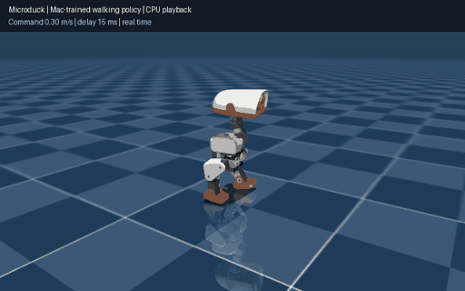

# Microduck RL on Mac

**Microduck reinforcement learning on Apple Silicon, with native Apple GPU learning.**
Built on the original [Microduck RL](https://github.com/pollen-robotics/microduck_rl)
environments and [mjlab](https://github.com/mujocolab/mjlab) for the
[Microduck robot](https://github.com/pollen-robotics/microduck).

The recommended development path combines **CPU MuJoCo physics with Apple GPU
policy inference and PPO training**. The original task managers, rewards,
randomization and BAM actuator calculations are retained. The goal is to train
locally on a Mac and deploy the same exported policy on Linux.

**Flat-ground walking has been demonstrated with CPU physics + Apple GPU training
on an M1 Max with 32 GB of unified memory (24-core GPU).** The completed run used
4,096 environments and 6,000 PPO updates. The exported policy sustains forward
walking in CPU simulation; precise speed, heading and low-speed command tracking
remain incomplete. See the [evaluation and limitations](docs/walking-validation.md).

*Actual policy playback at real-time speed, not generated animation. Training:
CPU MuJoCo + Torch MPS PPO. Playback: CPU MuJoCo + ONNX Runtime. Forward command:
0.30 m/s; measured sustained speed is approximately 0.18 m/s.*

Community support and pull requests are welcome. Reproducible bug reports,
Apple Silicon test results, task validation and performance improvements help
move the project forward. See the [training and playback guide](docs/mac-training.md).

For an end-to-end explanation of the existing reward, actor–critic, GAE and PPO
method, see [How walking training works](docs/walking-rl-explained.md).
These algorithms and the upstream training recipe are **not this project's contribution**;
the guide explains the method this Mac implementation uses.

## Phases

1. **Establish the best practical Mac setup for walking.** Get
   `Mjlab-Velocity-Flat-MicroDuck` and `Mjlab-Velocity-Rough-MicroDuck` working
   with a useful combination of simulation throughput and GPU learning. Validate
   training, checkpoint resume, playback and export. CPU physics with MPS learning
   is the current choice. **Flat-task training and sustained forward playback are
   validated within the documented test conditions.** Broader command tracking
   and rough terrain remain open.
2. **Validate the remaining tasks.** Extend and qualify the other Microduck
   environments and policy families. Establish repeatable behavior, evaluation
   and performance baselines before claiming support for each task.
3. **Improve native Apple GPU physics.** Use the validated walking and other tasks
   from phases 1–2 as baselines. Improve physics throughput while checking learning
   quality and simulation fidelity, and adopt GPU physics where it demonstrates
   a practical advantage. The experimental unified Metal effort now runs rigid-body
   dynamics, ground contacts, two-body self-contact constraint solving and PPO on
   the Apple GPU, with short training/export and checkpoint-continuation tests.
   **Self-contact narrowphase and reset-time synchronization still use the CPU.**
   Fully native GPU physics, full task qualification and an end-to-end speed
   advantage over CPU physics are not yet established.

## Limitations

- Experimental and currently focused on Apple Silicon. Intel Macs are not supported.
- Walking validation covers a single trained policy on nominal flat ground with
  a bounded range of actuator delays and small initial-pose perturbations. Low-speed,
  lateral and turn-in-place commands can leave it standing still; forward speed and
  heading are imperfect. Rough terrain and other tasks remain unvalidated.
- **These Mac changes and Mac-trained models have not been validated on Linux yet.**
- CPU physics with MPS learning remains the recommended backend. Experimental
  Metal physics still needs correctness and performance work; unified memory does
  not automatically remove CPU/GPU transfers.
- The playback results do not establish full training-distribution robustness,
  simulation equivalence across backends or readiness for physical robot deployment.
- Full Mac runtime, visualization and peripheral support is still in progress.

Licensed under [Apache License 2.0](LICENSE), the same license as the original
[Microduck RL project](https://github.com/pollen-robotics/microduck_rl/blob/develop/LICENSE).
Upstream license and attribution notices are retained.
